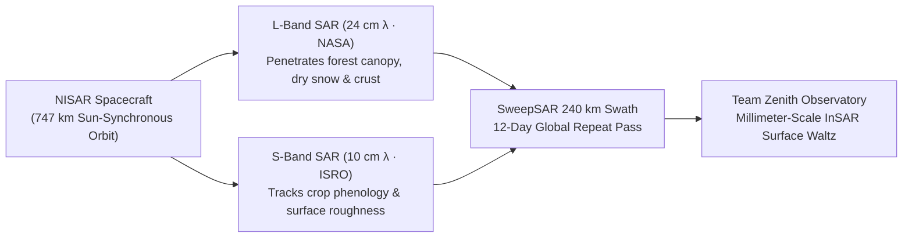

<div align="center">


# TEAM ZENITH // DANCING WITH THE SARs

### **NASA Space Apps Challenge 2026**
*Sense by Exploring — Tracking Earth’s Endless Waltz of Surface Changes with NASA-ISRO Synthetic Aperture Radar (NISAR)*

[](https://www.spaceappschallenge.org/)
[](#orbital-instrument--nisar-architecture)
[](https://react.dev/)
[](https://www.framer.com/motion/)
[](https://tailwindcss.com/)
[](https://vitejs.dev/)

---

</div>

## 01 // Challenge Overview

> *"Earth’s surface is an endless dance of natural processes and human activities, but these changes are often difficult to visualize, understand, and communicate. From wetland loss to forest wildfires, earthquakes, farming activities, glacier movement, and more, Earth is in a constant waltz of surface changes."*

**Team Zenith** presents the interactive observatory landing experience for **Dancing with the SARs**—built for the **NASA Space Apps Challenge 2026**. By harnessing dual-frequency radar remote sensing from the joint **NASA–ISRO Synthetic Aperture Radar (NISAR)** mission, our platform translates complex microwave backscatter and interferometric phase shifts (InSAR) into an intuitive, visual narrative of a living planet.

---

## 02 // Five Motions of a Living Planet

Unlike optical instruments blinded by cloud cover, wildfire smoke, or polar winter darkness, NISAR illuminates Earth's surface day and night across five core surface-change choreographies:

| Index | Phenomenon | Code | Radar Band | Primary Telemetry | Reference Region |
| :--- | :--- | :--- | :--- | :--- | :--- |
| **01** | **Glacier Movement** | `CRYO // GLACIER` | `L-Band (24 cm)` | `38.4 m/day` Ice-Stream Velocity | Jakobshavn Isbræ · `69.16° N` |
| **02** | **Earthquakes** | `TECT // SEISMIC` | `L-Band InSAR` | `±14.2 cm` Line-of-Sight Slip | Anatolian Fault · `37.22° N` |
| **03** | **Forest Wildfires** | `PYRO // CANOPY` | `L + S Dual Band` | `-6.8 dB` HV Canopy Backscatter | Boreal & Amazonia · `11.45° S` |
| **04** | **Wetland Loss** | `HYDR // WETLAND` | `L-Band HH/VV` | `-18.5 mm/yr` Deltaic Subsidence | Sundarbans Delta · `21.94° N` |
| **05** | **Farming Activities** | `AGRI // MOSAIC` | `S-Band (10 cm)` | `12-Day Cycle` Repeat-Pass Cadence | Indo-Gangetic Plain · `30.90° N` |

---

## 03 // Orbital Instrument — NISAR Architecture



- **L-Band Radar (`24 cm λ` · NASA)**: Longer microwave wavelength penetrates dense forest canopies and dry snowpack to lock onto sub-surface crustal deformation, wetland inundation, and glacial flow.
- **S-Band Radar (`10 cm λ` · ISRO)**: Shorter wavelength provides high sensitivity to agricultural crop structure, light vegetation, and surface moisture dynamics.
- **12-Day Global Cadence**: Images the entire Earth’s land and ice-covered surfaces every 12 days on both ascending and descending orbital tracks.

---

## 04 // Design System & Interactive Features

- **Dark Obsidian & Alabaster Minimalism**: Engineered with a deep void-black (`#040406`) and obsidian (`#08080C`) palette paired with crisp alabaster typography (`#F4F4F6`) and restrained crimson/violet radar accents.
- **Frosted Glass Cards (`SpotlightCard`)**: Multi-layered `backdrop-filter: blur(28px)` glassmorphic cards with specular top highlights, cursor-tracking radial border spotlights, and 3D spring micro-tilt.
- **Glass-Effect CTAs (`GlassButton`)**: Magnetic spring-physics buttons with internal specular shimmer sweeps and architectural split-compartment `+` crosshair triggers.
- **Above-the-Fold Planetary Crescent Hero**: Interactive SVG Earth horizon with mouse-parallax orbital tracks, continent stipple geometry, live interferometric pulse rings, and poetic vertical typography.
- **Scroll-Synced Frosted Navbar**: Real-time ScrollSpy section tracking (`01 Welcome` → `02 The Waltz` → `03 NISAR Mission` → `04 Team Zenith`) with smooth Framer Motion layout transitions.

---

## 05 // Project Structure

```text
web app/
├── public/
│   └── zenith-logo.png               # Official Team Zenith emblem
├── src/
│   ├── components/
│   │   ├── EarthHorizonHero.jsx      # Interactive planetary crescent & SAR pulse visual
│   │   ├── SurfaceWaltzCards.jsx     # 5 surface-change frosted glass cards & SVG radar waves
│   │   └── ZenithElements.jsx        # Vector emblem, FrostedCard, GlassButton & HUD marks
│   ├── App.jsx                       # Scroll-synced navbar, hero frame, SPACE/EARTH sections
│   ├── index.css                     # Custom frosted-glass & dot-matrix utilities
│   └── main.jsx                      # React 18 application entry point
├── index.html                        # Space Grotesk, Plus Jakarta Sans & JetBrains Mono setup
├── package.json                      # Scripts & dependencies
├── tailwind.config.js                # Custom dark theme & typography configuration
├── vercel.json                       # Vercel deployment & SPA rewrite configuration
└── vite.config.js                    # Vite bundler configuration
```

---

## 06 // Getting Started

### Prerequisites
- **Node.js** `>= 18.x`
- **npm** `>= 9.x`

### Installation & Local Development

```bash
# 1. Install dependencies
npm install

# 2. Launch the development server
npm run dev

# 3. Build for production
npm run build

# 4. Preview production build locally
npm run preview
```

---

## 07 // Deployment on Vercel

This repository is pre-configured with [`vercel.json`](./vercel.json) for zero-configuration deployment on **Vercel**:

[](https://vercel.com/new/clone?repository-url=https%3A%2F%2Fgithub.com%2Fnabil24024004%2FTeam-Zenith-Dancing-With-SARs)

1. **Via Vercel Dashboard (GitHub Integration)**:
   - Go to [vercel.com/new](https://vercel.com/new) and import `nabil24024004/Team-Zenith-Dancing-With-SARs`.
   - Vercel automatically detects **Vite** (`npm run build`, output directory `dist`) via `vercel.json`.
   - Click **Deploy**.
2. **Via Vercel CLI**:
   ```bash
   npx vercel --prod
   ```

---

<div align="center">

**Crafted by TEAM ZENITH**  
*NASA Space Apps Challenge 2026 · Dancing with the SARs*

</div>
