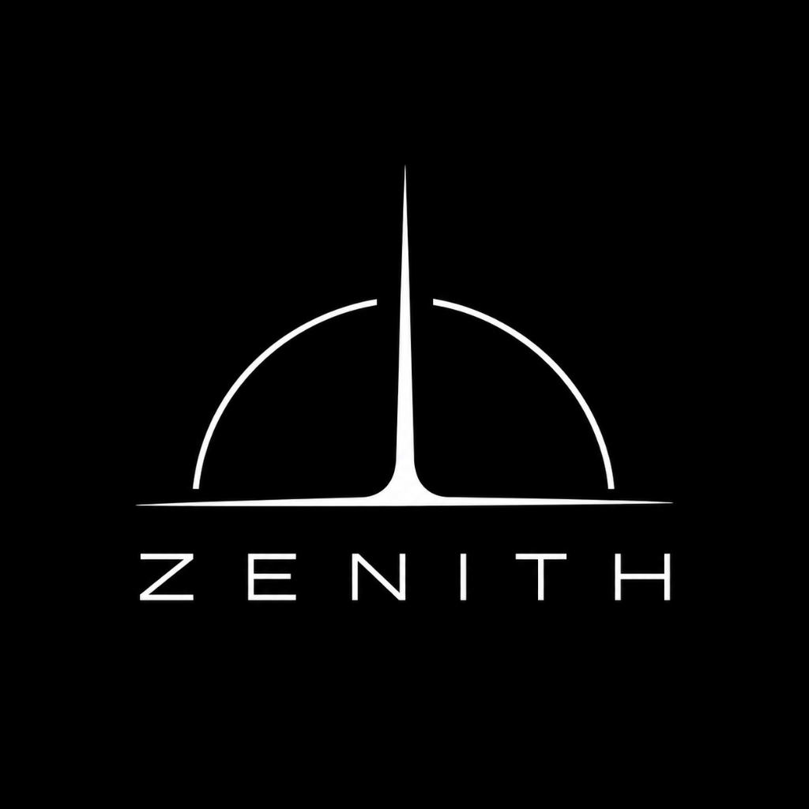
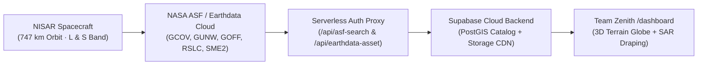

<div align="center">



# TEAM ZENITH // DANCING WITH THE SARs

### **NASA Space Apps Challenge 2026**
*Sense by Exploring — Tracking Earth’s Endless Waltz of Surface Changes with NASA-ISRO Synthetic Aperture Radar (NISAR)*

[](https://www.spaceappschallenge.org/)
[](#03--orbital-instrument--nisar-architecture)
[](#05--nisar-mission-data-explorer-dashboard--user-guide)
[](#07--environment-variables--supabase-setup)
[](https://react.dev/)
[](https://vitejs.dev/)

---

</div>

## 01 // Challenge Overview

> *"Earth’s surface is an endless dance of natural processes and human activities, but these changes are often difficult to visualize, understand, and communicate. From wetland loss to forest wildfires, earthquakes, farming activities, glacier movement, and more, Earth is in a constant waltz of surface changes."*

**Team Zenith** presents the interactive observatory and 3D orbital field console for **Dancing with the SARs**—built for the **NASA Space Apps Challenge 2026**. By combining dual-frequency radar remote sensing from the joint **NASA–ISRO Synthetic Aperture Radar (NISAR)** mission with a **CesiumJS 3D Terrain Globe**, **authenticated NASA Earthdata Cloud streaming**, and a **Supabase PostGIS + Storage CDN backend**, our platform translates complex microwave backscatter, interferometric phase shifts (InSAR), and L3 soil moisture grids into an intuitive visual experience.

---

## 02 // Five Motions of a Living Planet

Unlike optical instruments blinded by cloud cover, wildfire smoke, or polar winter darkness, NISAR illuminates Earth's surface day and night across five core surface-change choreographies:

| Index | Phenomenon | Code | Radar Band | Primary Telemetry | Reference Region |
| :--- | :--- | :--- | :--- | :--- | :--- |
| **01** | **Glacier Movement** | `CRYO // GLACIER` | `L-Band (24 cm)` | `38.4 m/day` Ice-Stream Velocity | Jakobshavn Isbræ · `69.16° N` |
| **02** | **Earthquakes** | `TECT // SEISMIC` | `L-Band InSAR` | `±14.2 cm` Line-of-Sight Slip | Anatolian Fault · `37.22° N` |
| **03** | **Forest Wildfires** | `PYRO // CANOPY` | `L + S Dual Band` | `-6.8 dB` HV Canopy Backscatter | Boreal & Amazonia · `11.45° S` |
| **04** | **Wetland Loss** | `HYDR // WETLAND` | `L-Band HH/VV` | `-18.5 mm/yr` Deltaic Subsidence | Sundarbans Delta · `21.94° N` |
| **05** | **Farming Activities** | `AGRI // MOSAIC` | `S-Band (10 cm)` | `12-Day Cycle` Repeat-Pass Cadence | Indo-Gangetic Plain · `30.90° N` |

---

## 03 // Orbital Instrument & Cloud Architecture



- **L-Band Radar (`24 cm λ` · NASA)**: Penetrates dense forest canopies and dry snowpack to measure sub-surface crustal deformation, wetland inundation, and glacial flow.
- **S-Band Radar (`10 cm λ` · ISRO)**: High sensitivity to agricultural crop structure, light vegetation, and surface moisture dynamics.
- **12-Day Global Cadence**: Images Earth’s land and ice-covered surfaces every 12 days on both ascending and descending orbital tracks.

---

## 04 // Design System & Landing Experience (`/`)

- **Dark Obsidian & Alabaster Minimalism**: Engineered with a deep void-black (`#040406`) and obsidian (`#08080C`) palette paired with crisp alabaster typography (`#F4F4F6`) and restrained crimson/violet radar accents (`#E11D48`, `#FB7185`, `#8B5CF6`, `#A78BFA`).
- **3D Planetary SAR Hero Globe (`EarthHorizonHero.jsx`)**: Interactive SVG spherical projection with full latitude/longitude graticule wireframe, continental landmass point-clouds, sweeping SAR swath corridors, geodesic telemetry arcs, and live phenomenon badges.
- **Frosted Glass Cards (`SpotlightCard`) & CTAs (`GlassButton`)**: Multi-layered `backdrop-filter: blur(28px)` glassmorphic surfaces with specular highlights and spring-physics interactions.
- **Scroll-Synced Frosted Navbar**: Real-time ScrollSpy section tracking (`01 Welcome` → `02 The Waltz` → `03 NISAR Mission` → `04 Team Zenith`).

---

## 05 // NISAR Mission Data Explorer (`/dashboard`) — User Guide

Navigate to **`/dashboard`** (or click **`Field Console`** / **`NISAR Data ↗`** on the landing page) to launch the **NISAR 3D Mission Data Explorer**.

### Layout Overview (2-Tier Widescreen Command Center)
- **Top Command Bar**: Live NASA ASF CMR spatial search presets, custom coordinate query inputs, and a one-click jump to the **561-Pixel L3 Soil Moisture Grid**.
- **Compact Telemetry Metric Strip**: Real-time counts for `CATALOG RECORDS`, `VISIBLE RESULTS`, `PRODUCT TYPES`, and `ACQUISITION SPAN`.
- **Tier 1 — Primary Spatial & Temporal Stage (`3-Column Grid`)**:
  - **Columns 1–2 (`span 2`, Widescreen 3D Terrain Globe)**: Interactive **CesiumJS 3D Globe** with Cesium World Terrain elevation meshes, CARTO dark vector basemap tiles, orbital swath footprints, draped L-band SAR radar imagery, and the 561-pixel Svalbard L3 Soil Moisture point cloud.
  - **Column 3 (`span 1`, Controls & Timeline Navigator)**: Unified **`01 // CONTROLS`** filter panel and **`03 // TIMELINE`** chronological acquisition list.
- **Tier 2 — Full-Width 3-Column Inspection Deck**:
  - **`04 // SELECTED RECORD`**: Granule metadata, `Download HDF5`, `Copy URL`, `Pin to Supabase`, and authenticated companion cloud assets.
  - **`05 // AUTHENTICATED NISAR SAR IMAGERY`**: Real L-band SAR browse raster viewer, polarization channel selector, and **`Draped on 3D Globe`** toggle.
  - **`06 // TELEMETRY & SUPABASE CLOUD`**: Live parsed `*_QA_SUMMARY.csv` verification checks and synced **Supabase Cloud Mission Watchpoints**.

### How to Use Every Feature on `/dashboard`

1. **Explore the Widescreen 3D Terrain Globe**:
   - **Orbit / Pan**: Left-click and drag on the globe.
   - **Zoom**: Scroll wheel (or pinch on trackpad).
   - **Tilt for 3D Mountain Relief**: Hold `Ctrl` (or `Cmd` on macOS) + left-click drag (or middle-click drag) to tilt the camera and inspect 3D mountain terrain in the Eastern Himalayas or Svalbard fjords.
   - **Select Any Footprint**: Click any SAR polygon on the globe (`Violet` = Ascending track, `Rose` = Descending track, `Crimson + White Border` = Selected) to fly the camera to that swath and automatically drape its real L-band radar image over the 3D terrain.

2. **Query Live NASA ASF CMR Data by Region or Coordinates**:
   - Use the preset buttons in the top command bar:
     - **`Local Snapshot + L3 SME2`**: Restores the 153 Meghna–Brahmaputra SAR footprints + 1 Svalbard L3 Soil Moisture dataset.
     - **`Live ASF · Bengal Delta`** (`23.81°N, 90.41°E`)
     - **`Live ASF · Eastern Himalayas`** (`27.65°N, 91.75°E`)
     - **`Live ASF · Sundarbans Coast`** (`21.95°N, 89.18°E`)
     - **`Live ASF · Svalbard Arctic`** (`77.52°N, 13.94°E`)
   - Or enter any custom **`Lat (°N)`** and **`Lon (°E)`** in the input boxes and click **`Query ASF`** to fetch live NISAR granules anywhere on Earth.

3. **Inspect the 561-Pixel L3 Soil Moisture (`SME2`) EASE-Grid 2.0**:
   - Click **`561-Pixel L3 Soil Moisture Grid`** in the top command bar.
   - The 3D globe flies directly to **Spitsbergen, Svalbard (`77.52°N, 13.94°E`)** and renders all **561 valid 200m pixels** (`0.088 – 0.349 cm³/cm³`) extracted from the NISAR L3 `SME2` HDF5 granule, while Panel `05` displays the volumetric soil moisture distribution (`0.088 min`, `0.214 mean`, `0.349 max cm³/cm³`).

4. **Filter & Step Through Chronological Acquisitions**:
   - In **`01 // CONTROLS`**, filter granules by **Product Type** (`GCOV`, `GUNW`, `GOFF`, `GSLC`, `RSLC`, `SME2`, `RRSD`, `RIFG`, `RUNW`, `ROFF`) or **Acquisition Window** (`Start date` / `End date`).
   - In **`03 // TIMELINE`**, click any acquisition in the chronological list (or use `↑` / `↓` arrow keys) to update the 3D globe and all three inspection panels below.

5. **Stream Real SAR Browse Imagery, QA CSV Checks & Companion Files**:
   - In **`04 // SELECTED RECORD`**, click **`Download HDF5`** to stream the science granule, or click the companion chips (**`QA Report PDF`**, **`QA Summary CSV`**, **`ISCE3 RunConfig YAML`**, **`ISO 19115 XML`**) to open authenticated NASA Earthdata assets via `/api/earthdata-asset`.
   - In **`05 // AUTHENTICATED NISAR SAR IMAGERY`**, view the real L-band radar backscatter browse PNG cached through Supabase Storage CDN (`nisar-browse-cache`), switch polarization tabs, or toggle **`Draped on 3D Globe`**.
   - In **`06 // TELEMETRY & SUPABASE CLOUD`**, inspect real-time **`PASS` / `WARN`** quality checks parsed directly from the granule's `*_QA_SUMMARY.csv`.

6. **Save & Sync Mission Watchpoints with Supabase Cloud**:
   - Click **`Pin to Supabase`** in **`04 // SELECTED RECORD`** to save the currently selected NISAR granule (with its coordinates, product type, and track/frame metadata) to the **`mission_watchpoints`** PostGIS table in Supabase Cloud.
   - In **`06 // TELEMETRY & SUPABASE CLOUD`**, click any saved watchpoint card to jump directly to its pinned granule on the 3D globe, or click the trash icon to remove it.

---

## 06 // Project Structure

```text
web app/
├── api/
│   ├── asf-search.js                 # Live NASA ASF CMR spatial search proxy + Supabase upsert
│   ├── earthdata-asset.js            # NASA Earthdata OAuth redirect resolver + Supabase Storage CDN cache
│   └── watchpoints.js                # CRUD API for Supabase Cloud mission_watchpoints
├── public/
│   └── zenith-logo.png               # Official Team Zenith emblem
├── resources/
│   ├── asf-results-2026-10-08_23-06-00.json  # 153 NISAR SAR granules (Meghna-Brahmaputra basin)
│   └── NISAR_L3_PR_SME2_*.h5         # Real NISAR L3 Soil Moisture (SME2) NetCDF4/HDF5 granule
├── scripts/
│   └── setup-supabase.mjs            # Automated Supabase Storage bucket & 154-granule seed script
├── supabase/
│   └── schema.sql                    # PostgreSQL + PostGIS (extensions schema) + RLS policies
├── src/
│   ├── components/
│   │   ├── EarthHorizonHero.jsx      # 3D spherical SAR globe hero visual
│   │   ├── SurfaceWaltzCards.jsx     # 5 surface-change frosted glass cards & SVG radar waves
│   │   └── ZenithElements.jsx        # Vector emblem, FrostedCard, GlassButton & HUD marks
│   ├── features/
│   │   └── explorer/
│   │       ├── CatalogFilters.jsx    # 01 // CONTROLS filter panel
│   │       ├── CatalogTimeline.jsx   # 03 // TIMELINE chronological selector
│   │       ├── ExplorerPage.jsx      # /dashboard 2-Tier Widescreen Command Center
│   │       ├── GlobeViewer.jsx       # 02 // 3D TERRAIN GLOBE (CesiumJS + SAR draping + SME2 grid)
│   │       ├── RecordDetails.jsx     # 3-Column Inspection Deck (04 Record | 05 SAR | 06 Telemetry)
│   │       ├── SyntheticPreview.jsx  # Fallback radar geometry preview for raw L0/L1 granules
│   │       ├── catalog.js            # WKT polygon parser, normalizer & filter engine
│   │       └── sme2Data.js           # Extracted 561-pixel L3 Soil Moisture EASE-Grid 2.0 coordinates
│   ├── lib/
│   │   └── supabaseClient.js         # Browser & server Supabase client helpers
│   ├── App.jsx                       # Scroll-synced navbar, hero frame, SPACE/EARTH sections
│   ├── index.css                     # Custom frosted-glass & dot-matrix utilities
│   └── main.jsx                      # React 18 router entry point (/ and /dashboard)
├── PROGRESS.md                       # Detailed engineering log & operator handbook
├── package.json                      # Scripts & dependencies
├── vercel.json                       # Vercel serverless API & SPA routing configuration
└── vite.config.js                    # Vite bundler + local serverless middleware plugin
```

---

## 07 // Environment Variables & Supabase Setup

Create a `.env` file in the root directory (`web app/.env`):

```env
# CARTO Basemaps & Cesium Ion 3D World Terrain
VITE_CARTO_API_KEY=your_carto_api_key
VITE_CESIUM_ION_TOKEN=your_cesium_ion_token

# NASA Earthdata Login JWT Bearer Token
EARTHDATA_TOKEN=your_nasa_earthdata_jwt_token

# Supabase Cloud Backend (PostgreSQL + PostGIS + Storage CDN)
VITE_SUPABASE_URL=https://your-project-ref.supabase.co
VITE_SUPABASE_ANON_KEY=your_supabase_anon_key
SUPABASE_SERVICE_ROLE_KEY=your_supabase_service_role_key
```

### Initializing a New Supabase Project
1. Open your **Supabase Dashboard → SQL Editor** and execute [`supabase/schema.sql`](./supabase/schema.sql). (This installs `postgis` inside the `extensions` schema and enables Row-Level Security on `public.nisar_granules`, `public.mission_watchpoints`, and `public.asf_query_cache`.)
2. Provision the storage buckets (`nisar-browse-cache` and `nisar-mission-store`) and seed all 154 NISAR granules + 3 default watchpoints:
   ```bash
   node scripts/setup-supabase.mjs
   ```

---

## 08 // Getting Started

```bash
# 1. Install dependencies
npm install

# 2. Launch the development server (with local /api/* middleware enabled)
npm run dev

# 3. Build for production
npm run build

# 4. Preview production build locally
npm run preview
```

---

<div align="center">

**Crafted by TEAM ZENITH**  
*NASA Space Apps Challenge 2026 · Dancing with the SARs*

</div>
